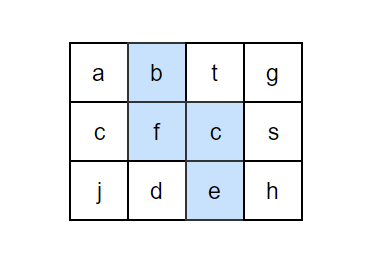

# 题目描述
请设计一个函数，用来判断在一个矩阵中是否存在一条包含某字符串所有字符的路径。路径可以从矩阵中的任意一个格子开始，每一步可以在矩阵中向左，向右，向上，向下移动一个格子。如果一条路径经过了矩阵中的某一个格子，则该路径不能再进入该格子。

例如下面的矩阵包含了一条 bfce 路径。但是矩阵中不包含"abcb"路径，因为字符串的第一个字符b占据了矩阵中的第一行第二个格子之后，路径不能再次进入该格子。



# 测试用例
* 功能测试（在多行多列的矩阵中存在或者不存在路径）
* 边界值测试（矩阵只有一行或者只有一列；矩阵和路径中的所有字母都是相同的）
* 特殊输入测试（输入空指针）

# 题目考点
* 考察应聘者对回溯法的理解。**通常在二维矩阵上找路径这类问题都可以应用回溯法解决。**
* 考察应聘者对数组的编程能力。我们一般都把矩阵看成一个二维数组。只有对数组的特性充分了解，只有可能快速、正确得实现回溯法的代码。
* 对应于数据结构中**图的遍历（DFS算法）**

# 思想
**这是一个可以用回朔法（见补充）解决的典型题。**

首先，在矩阵中任选一个格子作为路径的起点。

由于回朔法的递归特性，路径可以被看成一个栈。当在矩阵中定位了路径中前n个字符的位置之后，在与第n个字符对应的格子的周围都没有找到第n+1个字符，这个时候只要在路径上回到第n-1个字符，重新定位第n个字符。一直重复这个过程，直到路径字符串上所有字符都在矩阵中找到合适的位置。

由于路径不能重复进入矩阵的格子，还需要定义和字符矩阵大小一样的布尔值矩阵，用来标识路径是否已经进入每个格子。


# 基本想法（蛮力搜索升级）
从矩形中的一个点开始往他的上下左右四个方向查找，这个点可以是矩形中的任何一个点，所以代码的大致轮廓我们应该能写出来，就是遍历矩形所有的点，然后从这个点开始往他的4个方向走，因为是二维数组，所以有两个for循环

```Java
public boolean exist(char[][] board, String word) {
    char[] words = word.toCharArray();
    for (int i = 0; i < board.length; i++) {
        for (int j = 0; j < board[0].length; j++) {
            //从[i,j]这个坐标开始查找
            if (dfs(board, words, i, j, 0))
                return true;
        }
    }
    return false;
}
```
这里**关键代码是dfs这个函数**，因为每一个点我们都可以往他的4个方向查找，所以我们可以把它想象为一棵4叉树，就是每个节点有4个子节点，而树的遍历我们最容易想到的就是递归，我们来大概看一下
```Java
boolean dfs(char[][] board, char[] word, int i, int j, int index) {
    if (边界条件的判断) {
        return;
    }

    一些逻辑处理

    boolean res;
    //往右
    res = dfs(board, word, i + 1, j, index + 1)
    //往左
    res |= dfs(board, word, i - 1, j, index + 1)
    //往下
    res |= dfs(board, word, i, j + 1, index + 1)
    //往上
    res |= dfs(board, word, i, j - 1, index + 1)
    //上面4个方向，只要有一个能查找到（使用或），就返回true；
    return res;
}
```

两段代码整合如下

关键点
* 递归终止条件
	*  单个节点：越界和值是否相等
	*  整个搜索流程：所有字符都搜索完成
* 递归前操作
	* 为了防止分支污染，把board数组复制一份，标记已到过是这次搜索流程 

```Java
public boolean exist(char[][] board, String word) {
    char[] words = word.toCharArray();
    for (int i = 0; i < board.length; i++) {
        for (int j = 0; j < board[0].length; j++) {
            //从[i,j]这个坐标开始查找
            if (dfs(board, words, i, j, 0))
                return true;
        }
    }
    return false;
}

boolean dfs(char[][] board, char[] word, int i, int j, int index) {
	//单个节点的终止条件
    //边界的判断，如果越界直接返回false。index表示的是查找到字符串word的第几个字符，
    //如果这个字符不等于board[i][j]，说明验证这个坐标路径是走不通的，直接返回false
    if (i >= board.length || i < 0 || j >= board[0].length || j < 0 || board[i][j] != word[index])
        return false;
	//整个搜索过程的终止条件
    //如果word的每个字符都查找完了，直接返回true
    if (index == word.length - 1)
        return true;
    //为了防止分支污染，把board数组复制一份
    char[][] newArra = copyArray(board);
    //把newArra[i][j]置为特殊符号，表示已经被使用过了(注意：word中不能包含'.')
    newArra[i][j] = '.';
    //从当前坐标的上下左右四个方向查找
    boolean res = dfs(newArra, word, i + 1, j, index + 1) || dfs(newArra, word, i - 1, j, index + 1) ||
            dfs(newArra, word, i, j + 1, index + 1) || dfs(newArra, word, i, j - 1, index + 1);
    return res;
}

//复制一份新的数组
private char[][] copyArray(char[][] word) {
    char[][] newArray = new char[word.length][word[0].length];
    for (int i = 0; i < word.length; i++) {
        for (int j = 0; j < word[0].length; j++) {
            newArray[i][j] = word[i][j];
        }
    }
    return newArray;
}

```
这里在递归之前新建了一个数组，因为一般来说数组都是引用传递，当我们在一个分支修改了数组之后，其他分支上的数据也会改变，这也就造成了分支污染。所以在递归往下传递的时候我们都会新建一个数组，这样在当前分支的修改并不会影响到其他的分支，也就不会出错。

这样虽然也能解决问题，但每次递归传递的时候都要创建一个新的数组，会造成大量的空间浪费，并且每次都创建也非常耗时，所以一般我们都不会使用上面的方式。我们会使用另外一个方法，也就是**回溯**。


## 回溯升级（DFS）
那么回溯又是如何解决这个问题的呢，要想弄懂回溯我们首先要搞懂递归，递归分为两步，先是递，然后才是归。当我们沿着当前坐标往下传递的时候，我们可以把当前坐标的值修改，然后回归到当前坐标的时候再把当前坐标的值复原，这就是回溯的过程。我们来看下代码，比上面简洁了好多，运行效率也会有很大的提升。

#### 具体思路

* 解题思路：
本问题是典型的矩阵搜索问题，可使用 **深度优先搜索（DFS）**+ **剪枝（回溯的条件）**解决。

* 算法原理：

	* **深度优先搜索（DFS）**： 可以理解为暴力法遍历矩阵中所有字符串可能性。DFS 通过递归，先朝一个方向搜到底，再回溯至上个节点，沿另一个方向搜索，以此类推。

	* **剪枝（回溯条件）**： 在搜索中，遇到 这条路不可能和目标字符串匹配成功 的情况（例如：此矩阵元素和目标字符不同、此元素已被访问），则应立即返回，称之为 可行性剪枝 。

* 算法剖析（DFS递归算法刨析）：
	* 递归参数： 当前元素在矩阵 board 中的行列索引 i 和 j ，当前目标字符在 word 中的索引 k 。
	* 终止条件：
		* 返回 false ： ① 行或列索引越界 或 ② 当前矩阵元素与目标字符不同 或 ③ 当前矩阵元素已访问过 （③ 可合并至 ② ） **（一个节点的终止条件）** 。
		* 返回 true： 字符串 word 已全部匹配，即 k = len(word) - 1 。**（全部节点的终止条件）**
	* 递推工作：
		* (**递归前**) 标记当前矩阵元素： 将 board[i][j] 值暂存于变量 tmp ，并修改为字符 '.' ，代表此元素已访问过，防止之后搜索时重复访问。
		* （**递归中**）搜索下一单元格： 朝当前元素的 上、下、左、右 四个方向开启下层递归，使用 或 连接 （代表只需一条可行路径） ，并记录结果至 res 。
		* （**回溯时**）还原当前矩阵元素： 将 tmp 暂存值还原至 board[i][j] 元素。
		* 回溯返回值： 返回 res ，代表是否搜索到目标字符串。

```Java
public boolean exist(char[][] board, String word) {
    char[] words = word.toCharArray();
    for (int i = 0; i < board.length; i++) {
        for (int j = 0; j < board[0].length; j++) {
            //从[i,j]这个坐标开始查找
            if (dfs(board, words, i, j, 0))
                return true;
        }
    }
    return false;
}

boolean dfs(char[][] board, char[] word, int i, int j, int index) {
	//单个节点的终止条件
    //边界的判断，如果越界直接返回false。index表示的是查找到字符串word的第几个字符，
    //如果这个字符不等于board[i][j]，说明验证这个坐标路径是走不通的，直接返回false
    if (i >= board.length || i < 0 || j >= board[0].length || j < 0 || board[i][j] != word[index])
        return false;
	//整个搜索流程的判断
    //如果word的每个字符都查找完了，直接返回true
    if (index == word.length - 1)
        return true;
    //把当前坐标的值保存下来，为了在最后复原
    char tmp = board[i][j];
    //然后修改当前坐标的值
    board[i][j] = '.';
    //走递归，沿着当前坐标的上下左右4个方向查找
    boolean res = dfs(board, word, i + 1, j, index + 1) || dfs(board, word, i - 1, j, index + 1) ||
            dfs(board, word, i, j + 1, index + 1) || dfs(board, word, i, j - 1, index + 1);
    //递归之后再把当前的坐标复原
	//因为只代表此次搜索过程中，该元素已访问过，当初始i j变化时，又开始了另一次搜索过程
    board[i][j] = tmp;
    return res;
}
```


# 补充
* 回溯法：

	回溯法可以看成蛮力法的升级版，它非常适合由多个步骤组成的问题，并且每个步骤都有多个选项，当我们在某一步选择了其中一个选项时，就进行下一步，如果下一步不行不符合条件，则回溯到之前那一步，不然则继续选择一个选项进行下一步，就这样重复选择，直至到达最终的状态。

* 空间节省
	
	board临时赋值成‘.’，用来标记已访问的元素，省下了bool[][] visited的空


