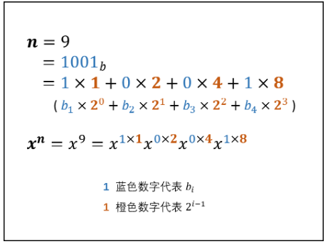

# 题目描述
实现函数double power(double base, int exponent)，求base的exponent次方。不得使用库函数，同时不需要考虑大数问题。

# 测试用例
把 **底数** 和 **指数** 分别设为正数、负数和零。

# 题目考点
* 考察应聘者 **思维的全面性**。
* 对效率比较高的面试官还会考察应聘者快速做乘方的能力。


# 解题思路
解题思路：
求 x^n 最简单的方法是通过循环将 n 个 x 乘起来，依次求 x^1, x^2, ..., x^{n-1}, x^n，时间复杂度为 O(n) 。快速幂法 可将时间复杂度降低至 O(log_2 n)，以下从“二进制” 角度解析**快速幂法**。

# 二进制角度解析快速幂 ：
利用十进制数字 n 的二进制表示，可对快速幂进行数学化解释。对于任何十进制正整数 n ，设其二进制为 "b_m...b_3b_2b_1" （ b_i为二进制某位值, i∈[1,m] ）



#node
Java 代码中 int32 变量 n∈[−2147483648,2147483647] ，因此当 n = -2147483648 时执行 n = −n 会因越界而赋值出错。解决方法是先将 n 存入 long 变量 b ，后面用 b 操作即可。

# 代码​
```java
class Solution {
    public double myPow(double x, int n) {
        if(x == 0) return 0;  //底数是0的情况直接返回
        long b = n;
        double res = 1.0;
        if(b < 0) {  //当指数小于0时，对底数进行处理，因为已经排除底数为0的情况 所以直接取倒数
            x = 1 / x;
            b = -b;
        }
        while(b > 0) {
            if((b & 1) == 1) res *= x;
            x *= x;
            b >>>= 1;
        }
        return res;
    }
}
​
```


# 补充


**以后需要用右移运算符代替除以2，用位与运算符代替求余运算符来判断一个数是奇数还是偶数。**

向下整除 n//2 等价于 右移一位 n>>>1 ；
取余数 n%2 等价于判断二进制最右一位值 n&1 ；
